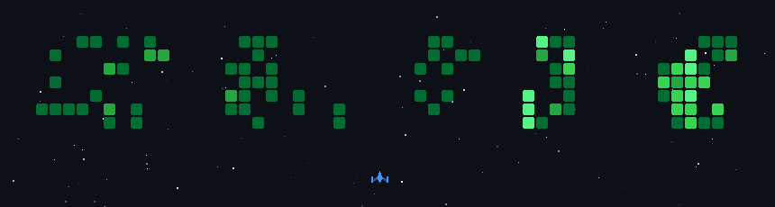

# José Alán Pomares Valdés

CS undergrad at BUAP, in Puebla, Mexico.

I build things with AI, fine-tuning language models, playing with logic
programming, and making game agents that beat me at my own games. I also
make games, and a robot on my desk talks without
asking me for permission.

Most of what's here is either research code, something I made because the
tool didn't exist yet, or a game.

### Tools

Python · TypeScript · C · C++ · Java · GDScript · SQL · Assembly · PHP · CSS · HTML · Bash
PyTorch · TensorFlow · Keras · scikit-learn · XGBoost · Hugging Face Transformers
Whisper · Llama · Ollama · LoRA · OpenCV · Stable Diffusion · Porygon
pandas · NumPy · SciPy · Matplotlib · Jupyter Lab · Google Colab
PostgreSQL · MySQL · Supabase · Clingo · Docker · Docker Compose · Git · n8n · ffmpeg
Linux · Vim · VS Code · Raspberry Pi · Arduino · ESP32 · Rotom
Godot Engine · Aseprite · itch.io · GIMP · Inkscape · OBS · LaTeX · Overleaf · Klinklang

*Three of those are Pokémon. Good luck.*

