<picture>
  <source media="(prefers-color-scheme: dark)" srcset="assets/fastfetch.png" />
  <source media="(prefers-color-scheme: light)" srcset="assets/fastfetch-light.png" />
  
</picture>

CS undergrad at **BUAP**, in Puebla, Mexico.

I make **video games** and build **AIs**, and I like it best when they meet.
I design adversarial games, train agents that learn to play them, and write
bots that end up beating me at my own games. What I enjoy most is creating
something **smarter than me**.

 

<picture>
  <source media="(prefers-color-scheme: dark)" srcset="maeul-in-the-sky-dark.svg" />
  <source media="(prefers-color-scheme: light)" srcset="maeul-in-the-sky-light.svg" />
  
</picture>
